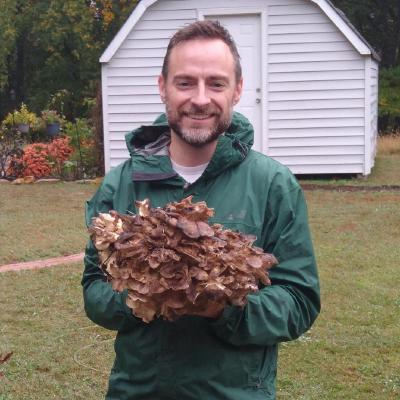

<link rel="stylesheet" href="academicons.css"/>
<link rel="stylesheet" href="styles.css" type="text/css">

### Assistant Professor of Biostatistics, Vanderbilt University Medical Center

  

I am an Assistant Professor in the [Department of Biostatistics](https://www.vumc.org/biostatistics) at Vanderbilt University Medical Center and Director of Graduate Recruitment for the [Vanderbilt University Biostatistics Graduate Program](https://www.vanderbilt.edu/biostatistics-graduate/).
I am a member of the Statistical Imaging Collective -- a group of faculty and students interested in statistical imaging at Vanderbilt.

My work develops statistical inference methods and software that can be used for scientific insight in medical imaging, including magnetic resonance imaging and multiplexed immunofluorescence imaging. In collaborative research, I utilize statistical tools such as generalized additive models, latent variable models, multilevel models, semiparametric methods, estimating equations, and machine learning. My statistical research focuses on robust inference procedures for high-dimensional imaging data using semiparametric methods. Lately, I am particularly interested in the use of robust effect sizes based in semiparametric theory and replicability in medical imaging.

 

#### Contact Information

Simon Vandekar  
Assistant Professor   
Department of Biostatistics  
Vanderbilt University Medical Center  
[simon.vandekar@vumc.org](mailto:simon.vandekar@vumc.org)

Director of Graduate Recruitment  
Biostatistics Graduate Program  
Vanderbilt University
